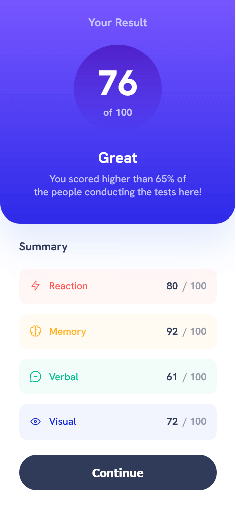
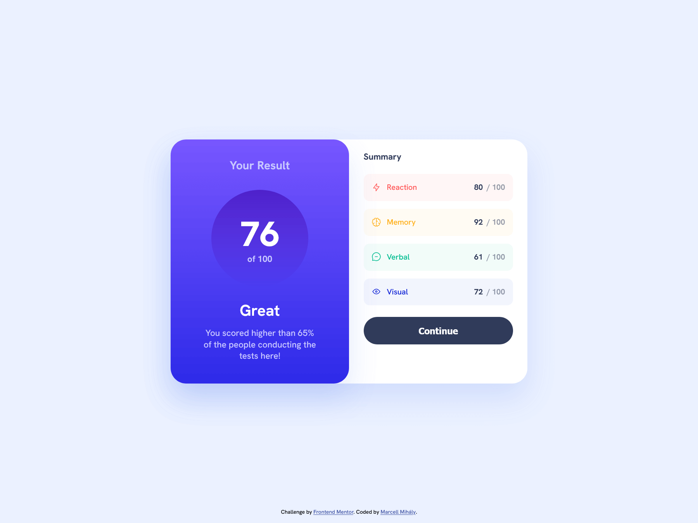

# Frontend Mentor - Results summary component solution

This is a solution to the [Results summary component challenge on Frontend Mentor](https://www.frontendmentor.io/challenges/results-summary-component-CE_K6s0maV). Frontend Mentor challenges help you improve your coding skills by building realistic projects.

## Table of contents

- [Overview](#overview)
  - [The challenge](#the-challenge)
  - [Screenshot](#screenshot)
  - [Links](#links)
- [My process](#my-process)
  - [Built with](#built-with)
  - [What I learned](#what-i-learned)
  - [Continued development](#continued-development)
  - [Useful resources](#useful-resources)
- [Author](#author)

## Overview

### The challenge

Users should be able to:

- View the optimal layout for the interface depending on their device's screen size
- See hover and focus states for all interactive elements on the page

### Screenshots

Mobile

---

Desktop

### Links

- Solution URL: [Add solution URL here](https://your-solution-url.com)
- Live Site URL: [Add live site URL here](https://your-live-site-url.com)

## My process

### Built with

- Semantic HTML5 markup
- Sass, [CSSModules](https://github.com/css-modules/css-modules)
- Mobile-first workflow
- [React](https://react.dev)
- [Vite.js](https://vitejs.dev/)

### What I learned

I used this project to experiment with new tooling. I switched from CRA to Vite.js, and since it is easier to integrate PostCSS, I tried to include it in my workflow.

Overall, I'm happy with Vite.js. There were some details, that were I had to find alternate solutions (eg. importing static assets using `import.meta`).

I was quite disappointed with PostCSS. A lot of the plugins are not maintained / deprecated and buggy. I was trying to patch them up, but a lot of them would clash. I couldn't recreate the same kind of toolset I would use with Sass. (the PostCSS Sass plugins are lacking some crucial functions eg. interpolation in variable names, etc.) In the end, I switched back to using Sass.

With Sass, I took another approach to setting fonts, inspired by MS Word's formatting presets. Now I am storing the style information in maps, and wrote a function to retrieve them, as if they were object with properties. It makes my script more organised.

### Continued development

I would still like to give PostCSS another chance, though I will have to dig deeper into learning Webpack, so that I can use Sass and PostCSS in tandem. There are some features, that I find very useful (eg. autoprefixer, postcss-preset-env).

### Useful resources

- [Vite.js Guide](https://vitejs.dev/guide/) - Very helpful guide for setting up project with Vite.js

## Author

- GitHub - [@mihalymarcell86](https://www.github.com/mihalymarcell86)
- Frontend Mentor - [@mihalymarcell86](https://www.frontendmentor.io/profile/mihalymarcell86)
